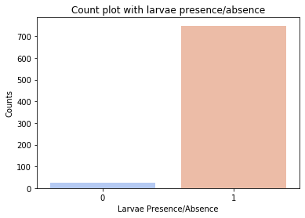

**Larval Presence Assessment Through Household &amp; Community Factors on** **Aedes aegypti** **Mosquito Population**

Thien-An Ha &amp; Robert Castro

May 11th, 2020

**Abstract:**

The _Aedes aegypti_ mosquito is a vector for the diseases dengue, Zika, and chikungunya, which present the greatest burden in tropical and subtropical regions. This study investigated the relationship between _Ae. aegypt_i larvae presence and household factors in conjunction with household-level vector control strategies in Guayaquil, Ecuador. We used random forest classification models to analyze data gathered from cross-sectional entomological surveys in Guayaquil for the period of 2013 to 2016. Our random forest model yielded about a 97% prediction accuracy for classifying households as having larvae present. The household-level features that were selected for this optimized model were protective mesh, dirty water in the breeding site, location of household, number of residents, water interruption frequency, breeding site dimensions, precipitation, and socioeconomic variables.

**Introduction:**

Vector-borne febrile illnesses such as Zika, chikungunya, and dengue are a pressing public health concern in Latin America and the Caribbean.1 The mosquito _Aedes aegypti_ is a significant vector of these arboviruses, which co-circulate in populations in the tropics and subtropics.1,2 The burden of these diseases weighs heavily on susceptible populations in low to middle-income countries, including Ecuador.1

From 2010 to 2014, over 70,000 cases of dengue were reported in Ecuador with the highest incidence clustered in urbanized coastal areas such as the city of Guayaquil.1 Guayaquil, the largest and most populated city in Ecuador, is the historic epicenter of dengue transmission in the country with its tropical, coastal climate.3,1 Dengue presents as asymptomatic to moderate febrile illness with some symptoms advancing to hemorrhage, shock, and death.4 Presently, without effective vaccinations, community- and household- level vector control of _Ae. aegypti_ remains the primary means of controlling these disease outbreaks.2

_Ae. aegypti_ is an effective vector because it is adaptable to urban environments where it lays eggs in artificial containers of water near human dwellings and preferentially feeds on humans.5 Previous studies done in Machala, Ecuador, found that local social-ecological conditions affected _Ae. aegypti_ proliferation and the presence of dengue.2 Therefore, further investigation into household factors, in conjunction with evaluation of vector control efforts, is necessary to examine the role they play in _Ae. aegypti_ dynamics. It is imperative to understand the characteristics of the habitats that are conducive to _Ae. aegypti_ larvae proliferation to best inform vector control efforts.

The objective of this study was to understand the household-level factors that may distinguish households with _Ae. aegypti_ larvae present as opposed to households without larvae present.

**Data:**

The dataset was compiled from a study conducted in the city of Guayaquil (population 2,994,000). Household cross-sectional surveys were conducted every month in Guayaquil from January 2013 to August 2016. Each house was only visited once in order to maximize the geographical area covered (Figure 1). Each visit assessed mosquito presence and conducted sampling in artificial containers of water.

**Figure 1**. Map of Guayaquil with sampled locations categorized by _Ae. aegypti_ larvae presence or absence

_Household Covariates_

Variables in the survey had been implicated in previous epidemiological studies as possible factors in _Ae. aegypti_ proliferation or significant vector-related predictors of dengue.2,6 We included number of children, number of adults, mosquito breeding sites regardless of species, water service interruptions, water service interruption duration, trash service per week, large solid collection, sewer connection, fumigation, abate use, biolarvicide use, canopy use, protective mesh use, outside location, contaminated water, and average water volume in our survey. Pupae index is the average pupae per container for each household.

Water interruptions were characterized by whether or not the household experienced a water service interruption in the last 24 hours. Collection of large solids are the municipal service of collecting large furniture or disposed tires. Fumigation, abate, and biolarvicide are Ministry of Health vector control efforts that were implemented between 2013 and 2016. These vector control efforts are self-reported by the household member interviewed. Fumigation is insecticide spraying, abate is an organophosphate larvicide, and biolarvicide refers to the use of _Bacillus thuringiensis israelensis_ to target the larval stage of a mosquito. Protective mesh refers to whether the household has mesh around windows and doors. Week 0 represents the total precipitation over the week that the entomological survey was conducted at that household. Week 1 is the weekly precipitation at a one week lag from this date and week 2 is the weekly precipitation at a two week lag from this date.

_Exploratory Data Analysis_

We were interested in creating a model that was able to classify whether households have _Ae. aegypti_ larvae present, which is our binary variable (Fig. 2).

**Figure 2**. Count plot of larvae presence and absence in Guayaquil dataset

Our other option was to create a regression model that analyzes pupae index. However, since pupae index focused only on positive counts (Fig. 3), we determined that the missing data on pupae absence would result in an incomplete analysis. _Ae. aegypti_ is an important dengue vector, therefore the main goal for vector control efforts would be to eliminate _Ae. aegypti_ in the home altogether. Furthermore, two of the three vector control efforts in this study target the larval stage which influenced our decision to choose larvae presence as our target variable. Our other option was a decision tree model, however, random forest models are less prone to overfitting. We utilized data cleaning methods that would prepare the data for a random forest classification model with _Ae. aegypti_ larvae presence as the outcome of interest. The aim of this study was to understand what affects the distinction between the presence and absence of larvae in households.

**Figure 3.** Distribution of pupae index reveals that there are only positive counts of pupae

_Data Cleaning_

Previous to this analysis, missing data had been imputed using random forest algorithms. This resulted in continuous numbers between 0 and 1 for binary data. For these variables, we rounded to the nearest integer. The original dataset also had 99999 in place of NAs that were removed completely.

After data cleaning, we designed tests to ensure that our data was clean. Larvae presence, interruption frequency, large solid collection, sewer connection, fumigation, abate, biolarvicide, canopy use, protective mesh, breeding sites, outside location, and dirty water were asserted to be binary variables (Fig. 4).

During our data cleaning process, we found that the number of household residents were accurately integer variables. We tested that water interruption duration was between 0 and 24 hours, and that trash collection per week was between 0 and 7 days. We tested that water volume, breeding site volume, and precipitation variables (week 0, week 1, and week 2) were numerical variables. We tested that the X coordinates and Y coordinates were within proper range and removed aberrations that were outside the city of Guayaquil. Although our approach does not require data scaling, we centered and standardized all numerical variables that were not binary.

**Figure 4.** Density plots exploring relationship between possible features (pupae index and week 0 [precipitation]) and target variable

 

Finally, the aim of this study was to understand which features of the dataset best explained the distinction between the absence and presence of larvae. This target variable was encoded as a binary outcome with 0 as households without larvae presence and 1, for those with larvae presence (Fig. 5).

**Figure 5.** Visualizing data cleaning of the larvae presence feature against the target variable. Larvae presence was rounded to the nearest integer to remove imputation aberrations

**Methods:**

772 households were surveyed in Guayaquil, and 749 were found to have _Ae. aegypti_ larvae presence. Of these 772 total households, 39 households had erroneous or missing data for their coordinates or were outside of the Guayaquil region. These households were omitted, bringing total households to 732. All numerical data was standardized.

For baseline purposes, we assessed a random forest model using week 0, our weekly precipitation at time of survey, and overcrowding index to classify our target variable, larvae presence. We used a test-train-split process followed by 15-fold cross validation for all methods in our analysis. After data exploration, we used a random forest classifier which was assessed and optimized through feature importance methods, cross-validation, and grid search hyperparameter tuning through the sci-kit learn package in Python. Exploratory post-analyses were performed by running principal components analysis (PCA) using all features, with a preliminary comparison with PCA using only continuous features.

**Results:**

Exploratory analyses using two features: overcrowding index and pupae index, had a training accuracy of 98% and a testing accuracy of 97% (Fig. 6). The initial random forest model that contained all of the possible features had a training accuracy of 100% and a testing accuracy of also 100%. However, 15-fold cross validation revealed a prediction accuracy of 96.7%.

Feature importance analysis found that every feature contributes to the model. According to the function used, the five least important features were presence/absence of a sewer connection, presence/absence of large solid collection, biolarvicide use in the last week, outside location or inside location of the breeding site, and water interruption frequency in the last week. The top five most important features were found to be pupae index, y-coordinate of location, number of children &amp; number of adults living in the household, and water volume where pupal index was found. To retain 90% cumulative importance, only 16 features were marked as necessary (Fig. 7).

**Figure 6.** Decision boundaries used for classification on training set and testing set for larvae presence given pupae index &amp; overcrowding

 

**Figure 7.** Feature importance analysis for random forest classification model with cut off at 90% cumulative importance

Grid search parameter tuning identified that the optimized model for prediction accuracy has a depth of 2 for each tree in the random forest. The parameter-optimized model has 15 trees with a minimum of 2 samples required to split an internal node. The training accuracy was again 100% with a testing accuracy of 100%. 15-fold cross-validation found that the parameter-tuned model had a prediction accuracy of 97%

Our final classification model is more parsimonious and included 16 variables with a final prediction accuracy of 97%. The optimized model parameters are the same between the more parsimonious model and the model with all features included. Between the models, there is no change in prediction accuracy using 15-fold cross-validation (97%), which affirms the exclusion of many features to avoid model overfitting. Our final classification model includes presence/absence of protective mesh, presence/absence of dirty water, x-coordinate of location, y-coordinate of location, number of children, number of adults, water interruption frequency, water volume, volume of the breeding site, total precipitation over the week that the entomological survey was conducted, weekly precipitation at a one week lag, weekly precipitation at a two week lag, pupae index, illiteracy, unemployment, and overcrowding.

**Discussion:**

This project found that the number of children, number of adults and neighborhood overcrowding index were among the most important features that contribute to larvae presence classification model. This is an interesting factor that may be used in future studies that seek to understand how social factors play a part in _Ae. aegypti_ proliferation. We thought that variables related to household services such as sewer connection, water interruption frequency and large solid collection would be important, however, they did not affect the prediction accuracy of our model.

Challenges that we encountered were related to data exploration and subsequent method choice. Initially, we categorized pupae index as 90th percentile, mean, and lastly, broken into quantiles as our target variable. However, running the entire analysis through these options made it evident that the prediction accuracy would always be generally close to the cutoff point chosen, which we decided was too obvious. Breeding sites were another option, however, breeding sites include all types of mosquito species and would not be related to our question of interest. These challenges lead into the limitations of this project. Despite using different variables, the prediction accuracy was still found to be related to the distribution of the target variable. For example, larvae presence makes up about 96% of the data and thus, our prediction accuracy hovers around this number. If a simplistic model guessed that all households have larvae present, the prediction error would only be 4%. However, we focused on which features were selected into the optimized model rather than solely prediction accuracy. This yielded a prediction accuracy that was above 96%.

The data cleaning methods and optimization involved ethical dilemmas. By rounding, we omit some information from the model which might skew our results. Additionally, the grid parameter search originally selected for the fewest number of trees possible which constrains our results to a decision tree instead of a random forest and encourages overfitting. To avoid this, we changed the minimum possible value here from 5 to 15 number of estimators and manually eliminated unnecessary features from the random forest classifier.

Surprisingly, the random forest model preferred continuous data for the features which would be important for future studies. Additional continuous features related to larval presence would strengthen the analysis. There are not many ethical concerns regarding our dataset since all households have been de-identified and the data does not focus on human subjects.

We made assumptions during our data cleaning process. By rounding numbers, we assumed it would not significantly impact our results. Furthermore, when we omitted data outside of the Guayaquil region, we assumed these were erroneous, however, it may be that only the X &amp; Y coordinates were wrong and we may be missing important data.

A limitation of the method used is that the random forest is difficult to interpret. There is little information given on how the random forest classifier determines where decision boundaries are drawn besides implementing training set decision boundaries onto the test set. Additionally, there is no information on whether features are positively or negatively correlated with our outcome provided by the random forest classifier. However, a logistic regression in future studies could be implemented to remediate this.

Future studies may implement PCA to examine which features contribute the most variance to the dataset. This dimensionality reduction technique may be more effective when deciding which variables to omit instead of our method of using feature importance and manual optimization of prediction accuracy.

**Figure 8.** Scree plot with all features included (left) and scree plot with only continuous variables included (right) with weights of each principal component

 

**Figure 9.** Scatter plot with all features (left) and scatter plot with only continuous variables (right) for the first two principal components

 

An interesting discovery is that with all features, the weight of the first principal component is very high. However, when we limit the data to only continuous variables, the weight of the first two principal components are much more reasonable. The scatter plot with only continuous variables had pupae index, overcrowding, illiteracy, unemployment, week 0 precipitation, week 1 lagged precipitation, week 2 lagged precipitation, water volume in breeding site, volume of breeding site, weekly trash collection, number of adults, number of children and duration of last water interruption included. Clustering and trends became more evident in this PCA than that with all possible features. These findings may be useful for a future study that aims to reduce the unavoidable noise in entomological data.

Our random forest classification project aimed to understand which features would be useful in classifying if a household has _Ae. aegypti_ larvae, a vector of dengue, present. These features were found to be related to precipitation, pupae index, socioeconomic status of the neighborhood, and other social factors. These findings may be the basis of some future study that seeks to understand _Ae. aegypti_ larval or pupal habitat.

**References**

1. Heydari N, Larsen DA, Neira M, et al. Household dengue prevention interventions, expenditures, and barriers to aedes aegypti control in machala, ecuador. _Int J Environ Res Public Health_. 2017;14(2). https://www.ncbi.nlm.nih.gov/pmc/articles/PMC5334750/. Accessed Jan 20, 2020. doi: 10.3390/ijerph14020196.

2. Kenneson A, Beltrán-Ayala E, Borbor-Cordova MJ, et al. Social-ecological factors and preventive actions decrease the risk of dengue infection at the household-level: Results from a prospective dengue surveillance study in machala, ecuador. _PLoS Negl Trop Dis_. 2017;11(12). https://www.ncbi.nlm.nih.gov/pmc/articles/PMC5771672/. Accessed Jan 20, 2020. doi: 10.1371/journal.pntd.0006150.

3. Lippi CA, Stewart-Ibarra AM, Muñoz ÁG, et al. The social and spatial ecology of dengue presence and burden during an outbreak in guayaquil, ecuador, 2012. _Int J Environ Res Public Health_. 2018;15(4). https://www.ncbi.nlm.nih.gov/pmc/articles/PMC5923869/. Accessed Jan 22, 2020. doi: 10.3390/ijerph15040827.

4. Stewart-Ibarra AM, Muñoz ÁG, Ryan SJ, et al. Spatiotemporal clustering, climate periodicity, and social-ecological risk factors for dengue during an outbreak in machala, ecuador, in 2010. _BMC infectious diseases_. 2014;14(1):610. https://www.ncbi.nlm.nih.gov/pubmed/25420543. doi: 10.1186/s12879-014-0610-4.

5. Zahouli JBZ, Utzinger J, Adja MA, et al. Oviposition ecology and species composition of aedes spp. and aedes aegypti dynamics in variously urbanized settings in arbovirus foci in southeastern côte d&#39;Ivoire. _Parasit Vectors_. 2016;9. https://www.ncbi.nlm.nih.gov/pmc/articles/PMC5041276/. Accessed Jan 20, 2020. doi: 10.1186/s13071-016-1778-9.

6. Paul KK, Dhar-Chowdhury P, Haque CE, et al. Risk factors for the presence of dengue vector mosquitoes, and determinants of their prevalence and larval site selection in Dhaka, bangladesh. _PLoS One_. 2018;13(6). https://www.ncbi.nlm.nih.gov/pmc/articles/PMC6013170/. Accessed Jan 20, 2020. doi: 10.1371/journal.pone.0199457.
